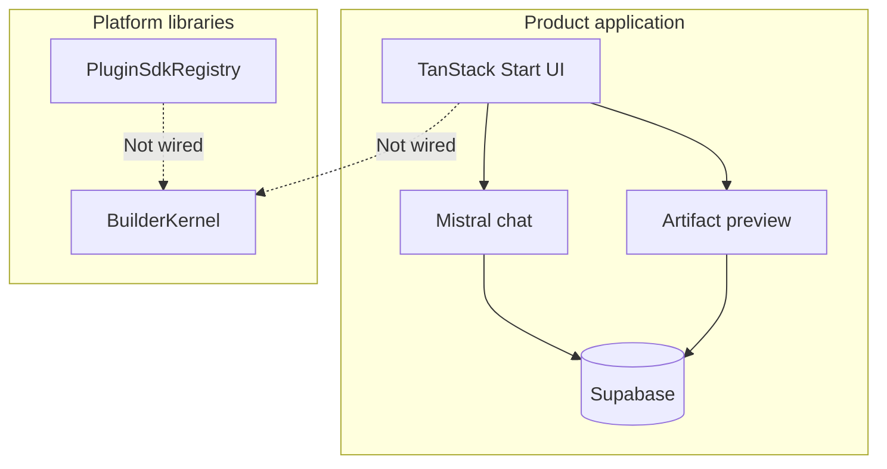

# AI Builder / NEXIFY Forge platform libraries

TanStack Start application (chat + artifact preview) with a headless **Builder Kernel** and isolated **Plugin SDK**. This README describes what is in the repository today. Planned work is labeled as such.

[](https://github.com/youh4ck3dme/cosy-app-kit/actions/workflows/ci.yml)

> Coverage badge: **not published** — `@vitest/coverage-v8` is installed but CI does not upload coverage.  
> License: **proprietary / private** — see [LICENSE](./LICENSE) and [docs/LICENSE_GUIDE.md](./docs/LICENSE_GUIDE.md).

## Vision

Evolve a working AI Builder product into a disciplined builder platform: sealed document engine, command history, invariants, and plugin foundations — before Canvas, marketplace, or AI mutation hosts.

## What exists today

| Area | Status | Location |
| --- | --- | --- |
| Product chat (Mistral only) | Implemented | `src/routes`, AI SDK + `@ai-sdk/mistral` |
| Artifact preview canvas | Implemented | `src/components/app-shell` (not kernel Canvas) |
| Supabase auth / DB | Implemented | `src/integrations/supabase`, `supabase/` |
| Builder Kernel | Implemented (library) | `src/lib/builder/` — tags `v0.4.5*` / `v0.4.5.1-hardening` |
| Plugin SDK | Implemented (library) | `src/lib/plugin-sdk/` — tag `v0.4.7-plugin-sdk` |
| Kernel ↔ product UI wiring | Not yet implemented | Product UI does not import kernel; `/dev/builder-playground` is developer tooling only |
| Builder Kernel Playground | Implemented (dev-only) | `/dev/builder-playground` — redirects away in production |
| Design Canvas (kernel consumer) | Not yet implemented | RPC types only |
| Kernel Observatory (v0.4.6) | Future milestone | Not a released public API |
| Plugin marketplace | Not yet implemented | — |

## Feature matrix

| Feature | Product app | Builder Kernel | Plugin SDK |
| --- | --- | --- | --- |
| Threaded chat + artifacts | Yes | — | — |
| Document model + Zod | — | Yes | — |
| Commands + undo/redo | — | Yes | — |
| Structural invariants | — | Yes | — |
| Kernel plugin registry | — | Yes | — |
| Manifest + lifecycle FSM | — | — | Yes |
| Sealed permission grants | — | Partial (facade) | Yes (frozen) |
| Live Canvas editor for documents | Product artifact UI only | Not yet | Not yet |

## Architecture preview



More: [docs/ARCHITECTURE.md](./docs/ARCHITECTURE.md) · [docs/diagrams/](./docs/diagrams/)

## Screenshots

Product UI captures are **not** checked into this repository yet. Placeholders:

- [docs/images/](./docs/images/)

Do not treat placeholders as product screenshots.

## Installation

```bash
bun install
cp .env.example .env.local   # then fill secrets locally — never commit them
bun run dev                  # typically http://localhost:8080
```

Mistral product chat needs `MISTRAL_API_KEY` (server-only). Dual-model routing is already in code:

| Mode | Model | Id |
| --- | --- | --- |
| Plan (default) | Mistral Large | `mistral-large-latest` |
| Build (code/HTML) | Codestral | `codestral-latest` |

Setup guide (placeholders only): [secrets/mistr.md](./secrets/mistr.md). Put real keys in `.env.local` or `secrets/mistr.local.md` (gitignored) — never commit them.

Details: [docs/INSTALLATION.md](./docs/INSTALLATION.md) · [docs/GETTING_STARTED.md](./docs/GETTING_STARTED.md)

## Local development commands

Package manager is **Bun** (not npm/yarn).

### Dev server

```bash
bun install
cp .env.example .env.local   # fill MISTRAL_API_KEY + Supabase
bun run dev
```

Open `http://localhost:8080` (use the URL Vite prints if different).

### Builder Kernel Playground (developer tooling)

On `main` (already merged):

```bash
git checkout main && git pull
bun run dev
```

Then open:

```text
http://localhost:8080/dev/builder-playground
```

Try: add Text node · Undo/Redo · validation · history · event viewer · JSON inspector.  
Production/preview builds redirect this route to `/` (`import.meta.env.DEV` guard).

### Unit tests

```bash
bun run test:unit
bun run test:unit src/lib/builder
bun run test:unit src/lib/plugin-sdk
bun run test:unit src/lib/builder/playground
bun run test:watch
```

### Engineering gate

```bash
bun run verify          # typecheck + unit + lint:gate + smoke
bun run verify:full     # + Playwright e2e

bun run typecheck
bun run lint:gate
bun run build
bun run smoke
```

### Other

```bash
bun run build && bun run preview
bun run test:e2e:install && bun run test:e2e
bun run format
```

### Recommended first session

1. `bun install`
2. Fill `.env.local` using [secrets/mistr.md](./secrets/mistr.md)
3. `bun run test:unit src/lib/builder/playground`
4. `bun run dev` → `/dev/builder-playground`
5. Sign in and open chat to exercise Large (Plan) + Codestral (Build)
6. `bun run verify`
7. Smoke AI: `curl -s http://localhost:8080/api/ai-status` → `mistralKeyPresent: true`

## Quick start — libraries

```bash
bun run test:unit src/lib/builder
bun run test:unit src/lib/plugin-sdk
bun run test:unit examples
```

Examples: [examples/](./examples/)

## Documentation

| Doc | Link |
| --- | --- |
| Docs index | [docs/README.md](./docs/README.md) |
| Architecture | [docs/ARCHITECTURE.md](./docs/ARCHITECTURE.md) |
| Builder Kernel | [docs/BUILDER_KERNEL.md](./docs/BUILDER_KERNEL.md) |
| Plugin SDK | [docs/PLUGIN_SDK.md](./docs/PLUGIN_SDK.md) |
| Security | [docs/SECURITY.md](./docs/SECURITY.md) / [SECURITY.md](./SECURITY.md) |
| Roadmap | [docs/ROADMAP.md](./docs/ROADMAP.md) / [ROADMAP.md](./ROADMAP.md) |
| Changelog | [docs/CHANGELOG.md](./docs/CHANGELOG.md) / [CHANGELOG.md](./CHANGELOG.md) |
| Contributing | [docs/CONTRIBUTING.md](./docs/CONTRIBUTING.md) / [CONTRIBUTING.md](./CONTRIBUTING.md) |
| ADRs | [docs/adr/](./docs/adr/) |
| RFCs (draft) | [docs/rfc/](./docs/rfc/) |
| Runbooks | [docs/runbooks/](./docs/runbooks/) |
| DevOps | [docs/DEVOPS.md](./docs/DEVOPS.md) |

## Roadmap (summary)

| Version | Status |
| --- | --- |
| v0.4.5 / v0.4.5.1 Kernel + hardening | Released (git tags) |
| v0.4.6 Observatory | Future milestone |
| v0.4.7 Plugin SDK | Released (git tag) |
| v0.5.0 Builder Runtime | Planned |

Full: [docs/ROADMAP.md](./docs/ROADMAP.md)

## Technical highlights (verified)

- Package manager: **Bun** (`bun.lock`); CI also sets Node 24
- Framework: **TanStack Start**, React 19, Vite 8, Tailwind 4, Zod 4
- Product AI policy: **Mistral only** (`MISTRAL_API_KEY`)
- Hosting: Lovable Cloud → Cloudflare Worker ([docs/product/deploy.md](./docs/product/deploy.md))
- CI gate: unit tests + typecheck + build (`.github/workflows/ci.yml`)
- `main` is protected (PR only) — see `.github/BRANCH_PROTECTION.md`

## Repository statistics (approximate, branch-dependent)

| Signal | Value |
| --- | --- |
| npm name | `tanstack_start_ts` (`private: true`) |
| npm version field | unset (releases via git tags) |
| Unit test pattern | `src/**/*.test.ts` + `examples/**/*.test.ts` |
| E2E | Playwright local; not in GitHub CI |

## Contributing

See [CONTRIBUTING.md](./CONTRIBUTING.md). Work on feature branches; do not push directly to `main`.

## License

Proprietary. All rights reserved unless a future OSI license is explicitly adopted. See [LICENSE](./LICENSE).
