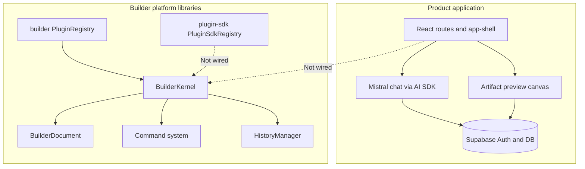
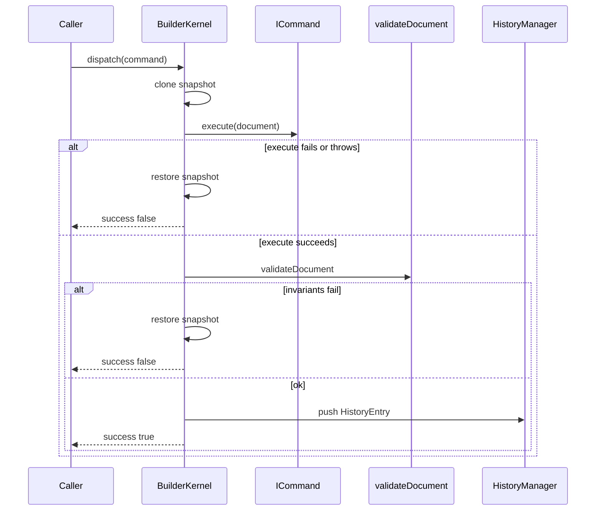
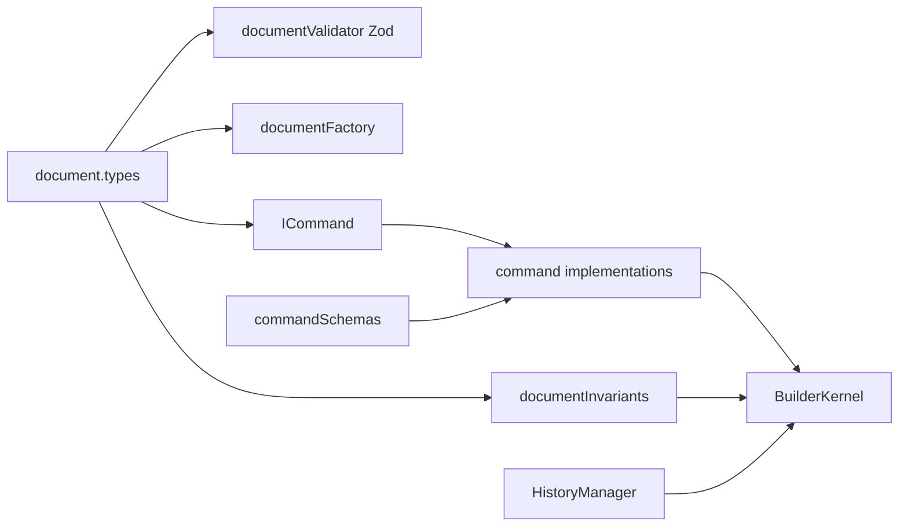
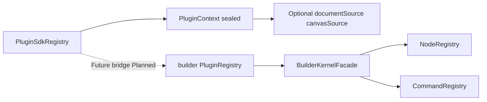
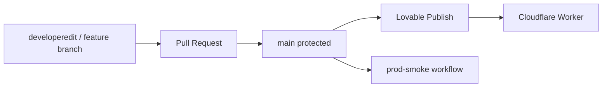

# Architecture

This document describes the **actual** architecture of the repository: a TanStack Start product application plus a headless Builder Kernel platform and an isolated Plugin SDK. Diagrams use Mermaid.

## 1. System overview



**Fact:** Product UI does not currently import `@/lib/builder`. The kernel is a library with unit tests, not the live editor runtime.

## 2. Repository layout (engineering-relevant)

```text
src/
  lib/builder/          Headless Builder Kernel
  lib/plugin-sdk/       Isolated Plugin SDK foundation
  components/           Product UI (includes artifact Canvas — not kernel Canvas)
  routes/               TanStack Router routes
  integrations/         Supabase client wiring
supabase/               Migrations and config
.github/workflows/      CI and prod smoke
docs/                   Engineering documentation
examples/               Runnable library examples
```

## 3. Builder Kernel execution flow



Entry points:

- `BuilderKernel.dispatch`
- `BuilderKernel.undo` / `redo`
- `BuilderKernel.transaction` (nested dispatch unsupported)
- `bootstrapBuilderKernel()` for registries + session wiring

## 4. Document and command dependency graph



## 5. Dual plugin systems

| System | Path | Role today |
| --- | --- | --- |
| Kernel plugins | `src/lib/builder/plugins/` | Register nodes/commands against kernel registries with permission checks |
| Plugin SDK | `src/lib/plugin-sdk/` | Manifest + lifecycle + sealed context; no live kernel reference |



Permission vocabularies differ. Do not assume interchangeability. See [PLUGIN_SDK.md](./PLUGIN_SDK.md) and [PLUGIN_ARCHITECTURE.md](./PLUGIN_ARCHITECTURE.md).

## 6. Security boundaries (summary)

| Boundary | Enforcement |
| --- | --- |
| Document mutation | Commands only; failed execute rolls back to snapshot |
| Invariants | Post-command `validateDocument` |
| External document access | Cloned / frozen getters |
| Kernel plugins | Permission-gated facade; core commands non-overwriteable |
| Plugin SDK | Frozen manifests; sealed context; read gating |
| Product AI | Mistral-only policy |
| Secrets | Env / Lovable secrets; not committed |

Details: [SECURITY.md](./SECURITY.md).

## 7. State management

| State | Owner |
| --- | --- |
| `BuilderDocument` | `BuilderKernel` (private field) |
| Undo / redo stacks | `HistoryManager` (default capacity 100) |
| Selection / UI | `BuilderUiState` (outside document history) |
| Product chat/artifacts | Supabase-backed application state |

No CRDT layer. **Not yet implemented.**

## 8. Deployment architecture



Branch protection: `.github/BRANCH_PROTECTION.md`. Deploy detail: [product/deploy.md](./product/deploy.md).

## 9. Related documents

- [BUILDER_KERNEL.md](./BUILDER_KERNEL.md)
- [DOCUMENT_MODEL.md](./DOCUMENT_MODEL.md)
- [COMMAND_SYSTEM.md](./COMMAND_SYSTEM.md)
- [diagrams/](./diagrams/)
