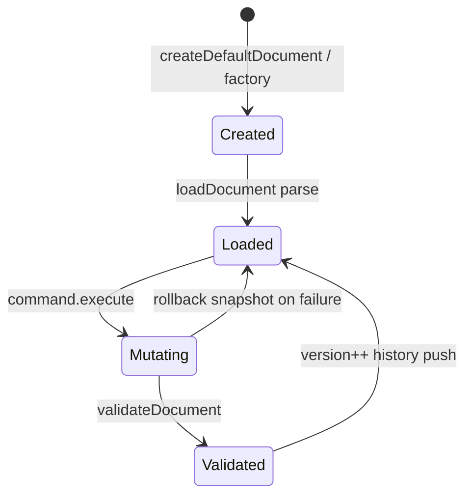

# Document model

Source: `src/lib/builder/document/`

## Overview

`BuilderDocument` is the kernel's persistent shape for a node tree with layout, style, interaction, assets, and metadata. Schema version constant: `DOCUMENT_SCHEMA_VERSION`.

## Primary types

Defined in `document.types.ts`:

| Type                                                 | Role                                                                                                                               |
| ---------------------------------------------------- | ---------------------------------------------------------------------------------------------------------------------------------- |
| `BuilderDocument`                                    | Root document                                                                                                                      |
| `BuilderNode`                                        | Node with `id`, `type`, `parentId`, `children`, `props`, layout/style/interaction                                                  |
| `NodeTree`                                           | `{ rootId, nodes: Record<NodeId, BuilderNode> }`                                                                                   |
| `DocumentMetadata`                                   | id, timestamps, version, schemaVersion                                                                                             |
| `LayoutSystem` / `StyleSystem` / `InteractionSystem` | Presentational systems                                                                                                             |
| `ResponsiveOverrides`                                | Per breakpoint partials                                                                                                            |
| `SourceImport`                                       | `"vision" \| "html" \| "figma" \| "prompt" \| "manual"` (field exists; adapters for vision/html/figma are **Not yet implemented**) |

## Validation layers

1. **Shape (Zod)** — `parseBuilderDocument` / `safeParseBuilderDocument` / `BuilderDocumentSchema`
2. **Structure (invariants)** — `validateDocument` / `assertValidDocument`

Always treat Zod success as insufficient alone for graph integrity. See [INVARIANTS.md](./INVARIANTS.md).

## Cloning and sealing

| Helper                       | Behavior         |
| ---------------------------- | ---------------- |
| `cloneDocument`              | Deep clone       |
| `deepFreeze`                 | Recursive freeze |
| Kernel `getDocument`         | Returns clone    |
| Kernel `getReadonlyDocument` | Clone + freeze   |

## Factories

`documentFactory.ts` provides `createDefaultDocument`, `createContainerNode`, `createNodeFromDefaults`, empty layout/style helpers.

## Graph helpers

`nodes/nodeGraph.ts`: `getNode`, `walkNodeIds`, `collectDescendantIds`.

## Lifecycle

