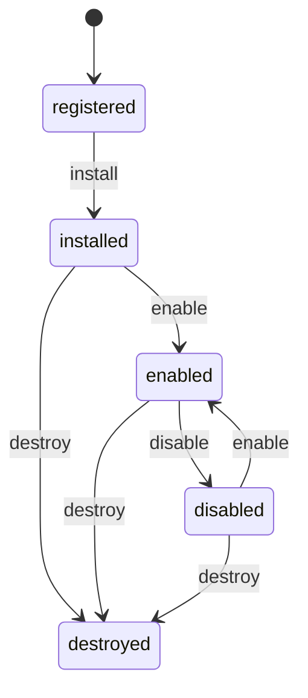

# Plugin SDK

Library path: `src/lib/plugin-sdk/`  
Release tag: `v0.4.7-plugin-sdk`  
Public barrel: `src/lib/plugin-sdk/index.ts`

## Purpose

Isolated foundation for plugin manifests, permissions, and lifecycle. Holds **no** live `BuilderKernel`, command manager, or node registry references.

## Components

| Module | Responsibility |
| --- | --- |
| `plugin.types.ts` | Manifest, permissions, lifecycle types, `PluginContext` |
| `pluginManifest.ts` | Zod validation + `freezePluginManifest` |
| `pluginPermissions.ts` | Enum validation / membership |
| `pluginLifecycle.ts` | FSM transitions + hooks |
| `pluginRegistry.ts` | `PluginSdkRegistry` |

## Permissions (SDK vocabulary)

```text
document.read
document.write
document.modify
canvas.read
canvas.modify
```

**Implemented on context today:** `readDocument` / `readCanvas` gated by `document.read` / `canvas.read`.

**Declared but inert on context:** write/modify permissions (foundation; mutation APIs are a later milestone).

## Lifecycle FSM



Illegal transitions throw `PluginLifecycleError`. State updates only after hooks succeed.

## Security properties (v0.4.7 hardening)

- Validated manifests are deep-frozen; `permissions` arrays are frozen.
- `PluginContext` is frozen; grant lists used for checks are frozen copies.
- Attempting `context.manifest.permissions.push(...)` throws in strict mode and cannot escalate grants.
- Context key set is limited to `pluginId`, `manifest`, `hasPermission`, `readDocument`, `readCanvas`.

## Host options

```ts
new PluginSdkRegistry({
  documentSource: { read: () => snapshot },
  canvasSource: { read: () => snapshot },
});
```

Sources are optional host-supplied read accessors — never a live kernel reference by design.

## Relation to kernel plugins

| | Kernel `PluginRegistry` | Plugin SDK |
| --- | --- | --- |
| Wire-up | `bootstrapBuilderKernel` | Standalone |
| Permissions | nodes/commands/events oriented | document/canvas oriented |
| Bridge | — | **Not yet implemented** |

## Example

[`examples/custom-plugin/`](../examples/custom-plugin/).

## Tests

```bash
bun run test:unit src/lib/plugin-sdk/plugin-sdk.test.ts
```
