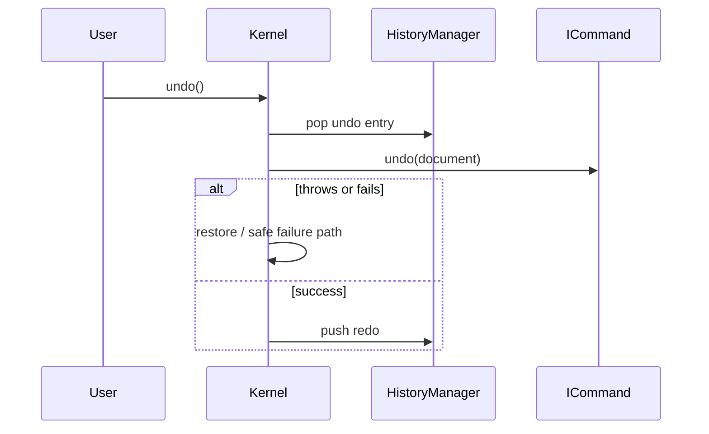

# Undo / Redo

Source: `src/lib/builder/history/historyManager.ts` + `BuilderKernel` undo/redo paths.

## Model

Each successful `dispatch` creates a `HistoryEntry`:

- serialized command (including durable `inverse` when provided)
- mutated node ids
- base document version
- live command instance for in-session undo/redo

`HistoryManager` maintains undo and redo stacks. Kernel constructs history with **max 100** entries by default.

## Public inspection

`kernel.getHistory()` returns `HistoryView`:

- `canUndo` / `canRedo`
- `getUndoStack` / `getRedoStack` (readonly)
- `exportSerialized`
- `exportEventLog`

Mutators (`push` / `clear`) are not exposed on the view.

## Safety properties (hardening)

- Undo/redo catch command throws and keep kernel usable.
- Failed execute does not push history.
- Integrity failure after execute restores snapshot and does not push history.
- ADD undo refuses unsafe graphs when children would be orphaned (hardening behavior; covered by tests).

## Flow

## Example

See [`examples/undo-redo/`](../examples/undo-redo/).

## Limitations

- History is **in-memory** for the kernel instance.
- Persistence of history across sessions: **Not yet implemented**.
- Collaborative / CRDT undo: **Not yet implemented**.
