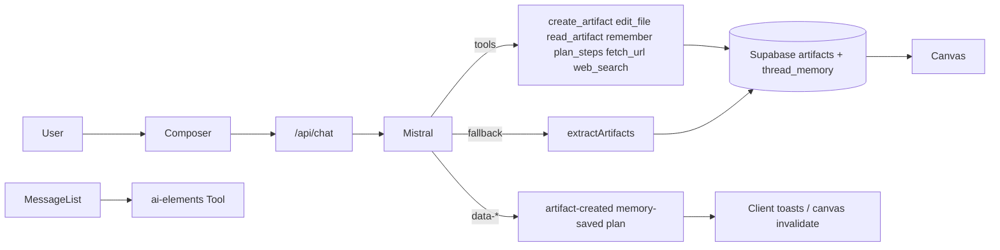

# Builder architecture (M6 docs freeze)



## AI

- Provider: **Mistral only** (`@ai-sdk/mistral`), key `MISTRAL_API_KEY`.
- Build mode prefers **Codestral** when thread model is Large/Medium default.
- Plan mode uses structured plan tools; no `create_artifact` / `edit_file`.
- Fence HTML parsing remains as fallback when the model emits ```html blocks **and** tools did not create an artifact.
- Optional grounding: `fetch_url` (SSRF-safe), `web_search` via `SEARCH_API_KEY` (Tavily) — both off by default in agent settings.
- Tool reference: [`docs/agent-tools.md`](./agent-tools.md).

## Key paths

| Path | Role |
|------|------|
| `src/routes/api/chat.ts` | Stream + tools + persist |
| `src/lib/agent/*` | tools, prompts, memory, artifacts, errors |
| `src/components/app-shell/*` | Chat shell + canvas |
| `src/lib/models.ts` | Catalog + routing |
| `docs/progress.md` | BPI scoreboard |
| `docs/todo.md` | Hub — parallel agent boards |
| `docs/groktodo.md` | Grok world (backend / agent) |
| `docs/cursortodo.md` | Cursor world A→Z |
| `docs/agent-tools.md` | Tools + versions API for UI |
| `artifact_versions` | Snapshots on tool/fence/save/restore |

## Auth / data

Supabase Auth + RLS on threads/messages/artifacts/thread_memory.
