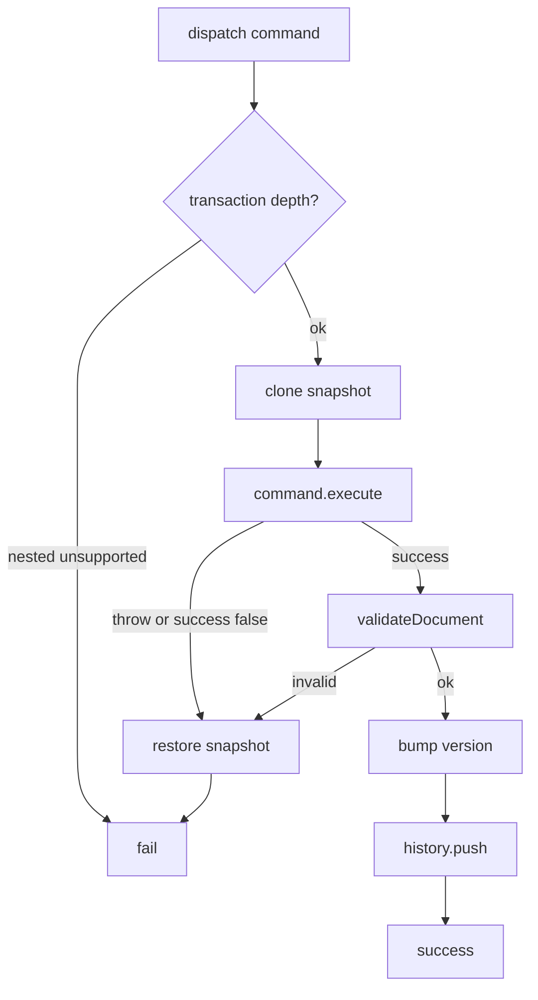

# Command lifecycle

```mermaid
flowchart TD
  A[dispatch command] --> B{transaction depth?}
  B -->|nested unsupported| Z[fail]
  B -->|ok| C[clone snapshot]
  C --> D[command.execute]
  D -->|throw or success false| E[restore snapshot]
  E --> Z
  D -->|success| F[validateDocument]
  F -->|invalid| E
  F -->|ok| G[bump version]
  G --> H[history.push]
  H --> I[success]
```
