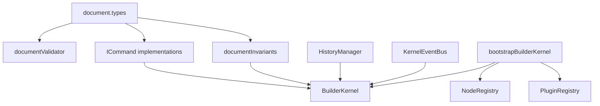

# Kernel dependency graph

```mermaid
flowchart TD
  Types[document.types]
  Zod[documentValidator]
  Inv[documentInvariants]
  Cmd[ICommand implementations]
  Hist[HistoryManager]
  Bus[KernelEventBus]
  Kernel[BuilderKernel]
  Facade[bootstrapBuilderKernel]
  Nodes[NodeRegistry]
  PReg[PluginRegistry]

  Types --> Zod
  Types --> Inv
  Types --> Cmd
  Cmd --> Kernel
  Inv --> Kernel
  Hist --> Kernel
  Bus --> Kernel
  Facade --> Kernel
  Facade --> Nodes
  Facade --> PReg
```
