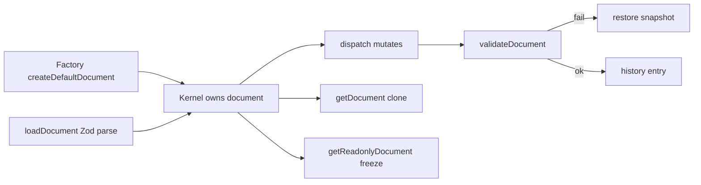

# Document lifecycle

```mermaid
flowchart LR
  F[Factory createDefaultDocument] --> K[Kernel owns document]
  L[loadDocument Zod parse] --> K
  K --> D[dispatch mutates]
  D --> V[validateDocument]
  V -->|fail| R[restore snapshot]
  V -->|ok| H[history entry]
  K --> G[getDocument clone]
  K --> RO[getReadonlyDocument freeze]
```
