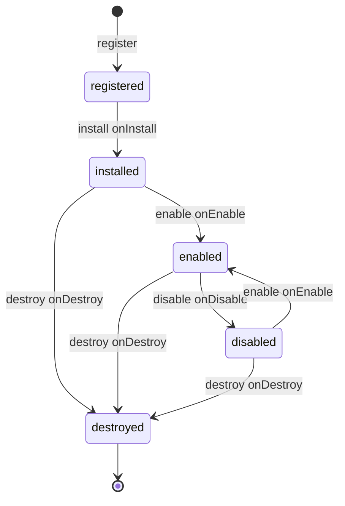

# Plugin SDK lifecycle

```mermaid
stateDiagram-v2
  [*] --> registered: register
  registered --> installed: install onInstall
  installed --> enabled: enable onEnable
  enabled --> disabled: disable onDisable
  disabled --> enabled: enable onEnable
  installed --> destroyed: destroy onDestroy
  enabled --> destroyed: destroy onDestroy
  disabled --> destroyed: destroy onDestroy
  destroyed --> [*]
```
