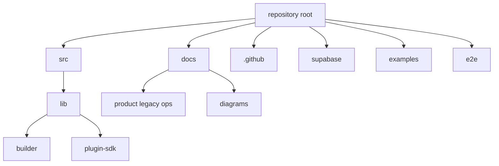

# Repository structure

```mermaid
flowchart TB
  Root[repository root]
  Root --> Src[src]
  Root --> Docs[docs]
  Root --> Gh[.github]
  Root --> Sb[supabase]
  Root --> Ex[examples]
  Root --> E2E[e2e]
  Src --> Lib[lib]
  Lib --> Builder[builder]
  Lib --> Psdk[plugin-sdk]
  Docs --> Product[product legacy ops]
  Docs --> Diagrams[diagrams]
```
