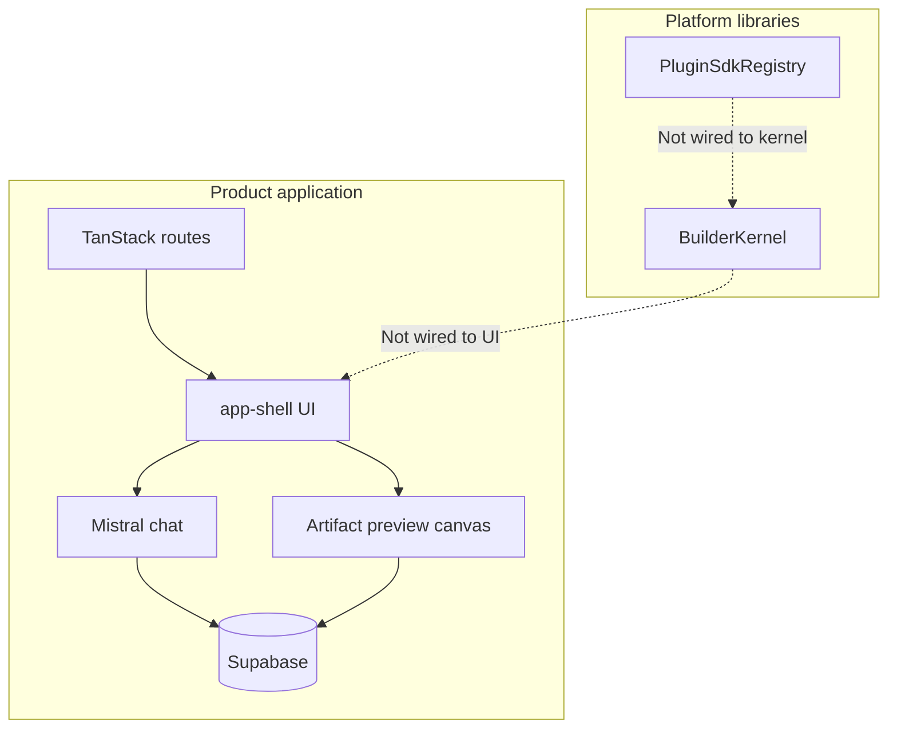

# System overview

```mermaid
flowchart TB
  subgraph app [Product application]
    Routes[TanStack routes]
    Shell[app-shell UI]
    Chat[Mistral chat]
    ArtifactCanvas[Artifact preview canvas]
    Supabase[(Supabase)]
  end

  subgraph libs [Platform libraries]
    BK[BuilderKernel]
    PSDK[PluginSdkRegistry]
  end

  Routes --> Shell
  Shell --> Chat
  Shell --> ArtifactCanvas
  Chat --> Supabase
  ArtifactCanvas --> Supabase

  BK -.->|Not wired to UI| Shell
  PSDK -.->|Not wired to kernel| BK
```
