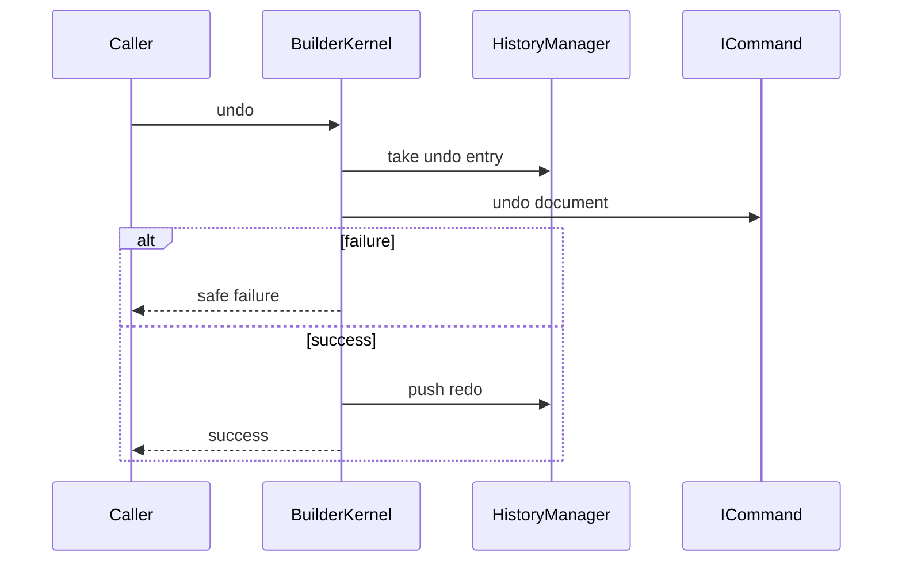

# Undo / redo flow

```mermaid
sequenceDiagram
  participant C as Caller
  participant K as BuilderKernel
  participant H as HistoryManager
  participant Cmd as ICommand

  C->>K: undo
  K->>H: take undo entry
  K->>Cmd: undo document
  alt failure
    K-->>C: safe failure
  else success
    K->>H: push redo
    K-->>C: success
  end
```
